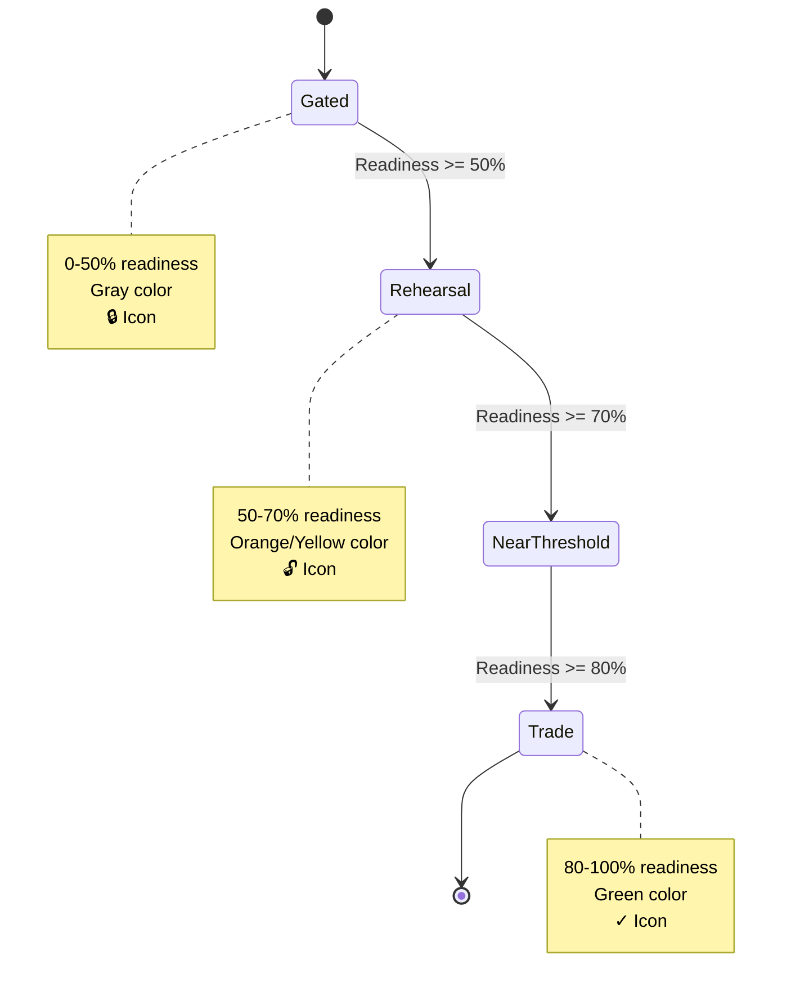
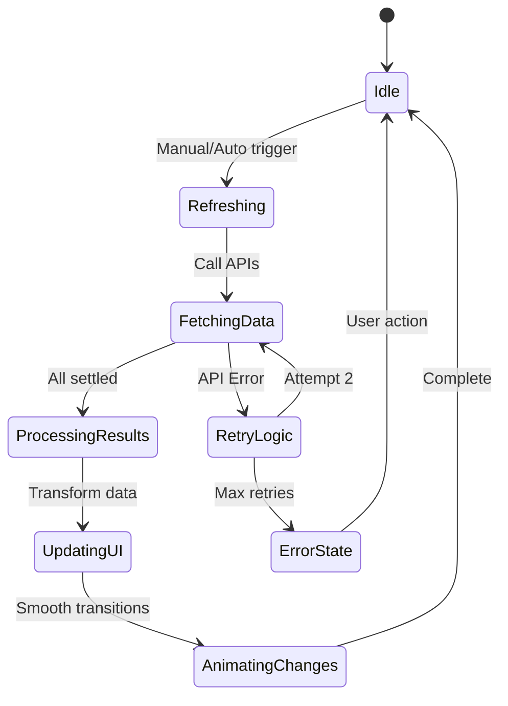

# Economics Page - UX & Design Patterns

**Quick Reference for Designers & Developers**

---

## 🎨 Component Hierarchy

```
economics.html
├── Header Bar
│   ├── Breadcrumb (Economics / Single Token, Many Markets)
│   ├── Status Pill (LIVE / REFRESHING / ERROR)
│   └── Refresh Button + Timestamp
│
├── Info Banner
│   └── "Economics Dashboard" explainer
│
├── Macro Economy Grid (3-col)
│   ├── Circulating Supply Card
│   │   ├── Big Number (animated)
│   │   ├── Progress Bar (gradient)
│   │   └── Issued vs Remaining
│   ├── Network Phase Card
│   │   ├── Status (Testnet/Beta/Mainnet)
│   │   └── Gate Summary
│   └── Block Reward Card
│       ├── Current Reward
│       ├── Activity Multiplier
│       ├── Decentralization Multiplier
│       └── Trend Chip (Growing/Stable/Declining)
│
├── Path to Mainnet Section
│   ├── Section Header
│   ├── Gate Progress Cards (4x)
│   │   ├── Market Icon + Name
│   │   ├── Status Chip (Trade/Rehearsal/Gated)
│   │   ├── Readiness % (color-coded)
│   │   ├── Progress Bar (80% threshold line)
│   │   └── Gap Indicator
│   └── History Chart (Line, 4 datasets)
│
├── Market Deep Dives (2x2 Grid)
│   ├── Storage Card
│   │   ├── Utilization KPI
│   │   ├── Rent Cost KPI
│   │   └── Trend Chart
│   ├── Compute Card
│   ├── Energy Card
│   └── Ad Card
│
├── Interactive Simulator
│   ├── Section Header + Reset Button
│   ├── Control Sliders (2x)
│   │   ├── Transaction Volume (0.5x - 5x)
│   │   └── Unique Validators (100 - 10K)
│   ├── Output Metrics (3x)
│   │   ├── Projected Reward
│   │   ├── Annual Inflation
│   │   └── Time to Cap
│   ├── Formula Display (visual)
│   └── Projection Chart (10-year)
│
├── Treasury & Governance
│   ├── Treasury Balance Card
│   ├── Fees Collected Card
│   ├── Active Proposals Card
│   └── Token Flow Placeholder
│
└── Error Drawer (hidden by default)
```

---

## 🖌️ Interaction Patterns

### 1. Loading States
**Pattern:** Skeleton → Fade-in with data
```html
<!-- Before data -->
<div class="skeleton" style="height: 80px;"></div>

<!-- After data -->
<div class="p-4 bg-gray-800/30 rounded-lg fade-in">
  [Actual content]
</div>
```

### 2. Number Animations
**Pattern:** Count-up from current to target
```javascript
// 20-step interpolation over 500ms
animateNumber('element-id', targetValue, formatter);
```

**Visual:**
```
1,234,567 ➞ 1,234,600 ➞ 1,234,650 ➞ ... ➞ 1,250,000
  ^50ms      ^50ms      ^50ms            ^500ms total
```

### 3. Progress Bars
**Pattern:** Width transition with color gradient
```css
.gate-progress-bar {
  transition: width 0.6s cubic-bezier(0.4, 0, 0.2, 1);
}
```

**Threshold Indicator:**
```html
<div class="gate-threshold-line"></div> <!-- At 80% mark -->
```

### 4. Status Color Coding
**System:**
| Readiness | Color | Class | Icon |
|-----------|-------|-------|------|
| 0-50% | Gray | `readiness-critical` | 🔒 Gated |
| 50-70% | Orange | `readiness-warning` | 🔓 Approaching |
| 70-80% | Yellow | `readiness-good` | ⚠️ Near threshold |
| 80-100% | Cyan | `readiness-excellent` | ✓ Ready |
| Trade | Green | `status-trade` | ✓ Open |

### 5. Tooltips
**Pattern:** Hover-activated explanations
```html
<span class="tooltip" data-tooltip="Total BLOCK tokens issued">ⓘ</span>
```

**Styling:**
- Dark background (`rgba(17, 24, 39, 0.95)`)
- Amber border (`rgba(251, 191, 36, 0.3)`)
- Appears above element with arrow
- 200ms fade-in

### 6. Card Hover Effects
**Pattern:** Lift + Glow on hover
```css
.market-card-hover:hover {
  transform: translateY(-2px);
  box-shadow: 0 8px 24px rgba(168, 85, 247, 0.2);
}
```

---

## 🎬 Animation Timings

### Entrance Animations
```
Page Load
  ↓
[0ms]    Header fades in
[40ms]   First macro card reveals
[80ms]   Second macro card reveals
[120ms]  Third macro card reveals
[160ms]  Gate section reveals
[200ms]  Market cards reveal (staggered)
```

### Interaction Feedback
```
Button Click    → Immediate visual change (0ms)
Slider Drag     → Debounced update (300ms)
Data Refresh    → Fade old → Fade new (750ms)
Number Change   → Count animation (500ms)
Progress Bar    → Width transition (600ms)
```

---

## 📱 Responsive Breakpoints

### Desktop (lg: 1024px+)
```
+----------------+----------------+----------------+
|   Supply       | Network Phase  |  Block Reward  |
+----------------+----------------+----------------+
|           Path to Mainnet Section               |
+--------------------------------------------------+
|   Storage   |   Compute   |   Energy   |  Ads  |
|   Market    |   Market    |   Market   | Mkt   |
+-------------+-------------+------------+-------+
|         Interactive Simulator Section           |
+--------------------------------------------------+
```

### Tablet (md: 768px)
```
+------------------------+------------------------+
|   Supply               | Network Phase          |
+------------------------+------------------------+
|       Block Reward (spans 2 cols)              |
+------------------------------------------------+
|           Path to Mainnet Section              |
+------------------------------------------------+
| Storage Market    |  Compute Market           |
+-------------------+---------------------------+
| Energy Market     |  Ad Market                |
+-------------------+---------------------------+
```

### Mobile (< 768px)
```
+------------------------+
|   Supply               |
+------------------------+
|   Network Phase        |
+------------------------+
|   Block Reward         |
+------------------------+
| Path to Mainnet        |
+------------------------+
| Storage Market         |
+------------------------+
| Compute Market         |
+------------------------+
| Energy Market          |
+------------------------+
| Ad Market              |
+------------------------+
| Simulator (stacked)    |
+------------------------+
```

---

## ♻️ State Machine Diagrams

### Gate Status Progression


### Data Refresh Flow


---

## ⌨️ Keyboard Accessibility

### Shortcuts
| Key | Action | Context |
|-----|--------|------|
| `R` | Refresh all data | Not in input field |
| `Tab` | Navigate focusable elements | Always |
| `Enter` | Activate button/link | On focus |
| `Space` | Toggle/activate | On checkbox/button |
| `Escape` | Close drawer | Error drawer open |
| `⌘K` | Open command palette | Always (from shell) |

### Focus Order
1. Skip to content link
2. Refresh button
3. Gate refresh button
4. Transaction volume slider
5. Unique miners slider
6. Reset simulator button
7. Error clear button (if visible)

---

## 🎨 Color Semantic Mapping

### Primary Colors (Functional)
```css
/* Supply & Issuance */
--amber-glow: #fbbf24;
--amber-bg: rgba(251, 191, 36, 0.1);

/* Network & Compute */
--cyan-glow: #22d3ee;
--cyan-bg: rgba(34, 211, 238, 0.1);

/* Status Indicators */
--green-open: #4ade80;      /* Trade mode */
--yellow-rehearsal: #eab308; /* Near threshold */
--gray-gated: #9ca3af;       /* Locked */
--red-critical: #f87171;     /* Low readiness */

/* Accents */
--purple-accent: #a855f7;    /* Ads, highlights */
```

### Status Pills
```html
<span class="chip chip-pill status-trade">✓ Trade</span>
<span class="chip chip-pill status-rehearsal">Rehearsal</span>
<span class="chip chip-pill status-gated">🔒 Gated</span>
```

---

## 📊 Chart Theming

### Chart.js Configuration
```javascript
const chartTheme = {
  backgroundColor: 'rgba(17, 24, 39, 0.5)',
  borderColor: 'rgba(156, 163, 175, 0.1)',
  gridColor: 'rgba(156, 163, 175, 0.1)',
  textColor: '#9ca3af',
  tooltipBg: 'rgba(17, 24, 39, 0.95)',
  tooltipBorder: 'rgba(251, 191, 36, 0.3)'
};
```

### Animation Easing
```javascript
animation: {
  duration: 750,
  easing: 'easeInOutQuart'
}
```

---

## 🔍 Empty State Patterns

### Pattern 1: No Data Available
```html
<div class="p-8 text-center text-gray-500">
  <div class="text-sm">No gate data available</div>
  <div class="text-xs mt-2">Waiting for governor status...</div>
</div>
```

### Pattern 2: Chart Empty State
```html
<div class="absolute inset-0 flex items-center justify-center text-xs text-gray-500">
  No data available
</div>
```

### Pattern 3: Loading Skeleton
```html
<div class="p-4 bg-gray-800/30 rounded-lg skeleton" style="height: 80px;"></div>
```

---

## 🧑‍🎨 Design Principles Applied

### 1. Progressive Disclosure
- **Macro first**: Supply → Network Phase → Block Reward
- **Then details**: Gate status → Market specifics
- **Finally exploration**: Interactive simulator

### 2. Information Density
- **Hero metrics**: Large, glowing numbers for key data
- **Supporting metrics**: Smaller, grouped contextually
- **Charts**: Minimal chrome, focus on data

### 3. Visual Hierarchy
```
Level 1: Section Titles (panel-title)
Level 2: Card Headers (text-2xl font-bold)
Level 3: Metric Labels (text-xs uppercase)
Level 4: Values (text-4xl bold with glow)
Level 5: Meta info (text-xs text-gray-500)
```

### 4. Feedback Loops
- **Immediate**: Button press, slider drag
- **Fast**: Number animations (500ms)
- **Smooth**: Progress bars (600ms)
- **Informative**: Toasts for success/errors

### 5. Error Recovery
- **Auto-retry**: 2 attempts with exponential backoff
- **Graceful degradation**: Show cached data if available
- **Clear messaging**: Error drawer with retry button
- **Non-blocking**: Errors don't crash the page

---

## 📦 Component Reusability

### Metric Card Template
```html
<div class="kpi metric-card">
  <div class="kpi-label">[Label]</div>
  <div class="kpi-value">[Value]</div>
  <div class="kpi-meta">[Unit/Context]</div>
</div>
```

### Market Card Template
```html
<div class="panel-blade hologram-panel p-6 space-y-4 market-card-hover">
  <div class="flex items-center justify-between mb-3">
    <div>
      <div class="text-xs text-gray-400 uppercase">[Market Name]</div>
      <div class="text-2xl font-bold text-white">[Title]</div>
    </div>
    <span class="chip chip-pill">[Status]</span>
  </div>
  <div class="grid grid-cols-2 gap-3">
    [KPI Cards]
  </div>
  <canvas id="chart" height="100"></canvas>
</div>
```

### Gate Progress Template
```html
<div class="p-4 bg-gray-800/30 rounded-lg border border-gray-700/50">
  <div class="flex items-center justify-between mb-3">
    <div class="flex items-center gap-3">
      <span class="text-2xl">[Icon]</span>
      <div>
        <div class="text-sm font-semibold">[Market Name]</div>
        <span class="text-xs status-chip">[Status]</span>
      </div>
    </div>
    <div class="text-right">
      <div class="text-2xl font-bold readiness-class">[%]</div>
    </div>
  </div>
  <div class="relative">
    <div class="progress-bar">[Bar]</div>
    <div class="gate-threshold-line"></div>
  </div>
  <div class="text-xs gap-indicator">[Message]</div>
</div>
```

---

## 🔧 Developer Checklist for New Components

- [ ] Add semantic HTML5 tags (`<section>`, `<article>`, etc.)
- [ ] Include ARIA labels (`aria-label`, `aria-live`)
- [ ] Provide loading state (skeleton or spinner)
- [ ] Handle empty state gracefully
- [ ] Add error boundary if fetching data
- [ ] Test responsive behavior (mobile/tablet/desktop)
- [ ] Verify keyboard navigation works
- [ ] Add tooltips for complex metrics
- [ ] Use consistent color classes (from palette)
- [ ] Animate transitions (numbers, progress)
- [ ] Log errors to console and drawer
- [ ] Export debug interface to `window`

---

*This guide ensures consistency across future updates and makes onboarding new developers seamless.*
